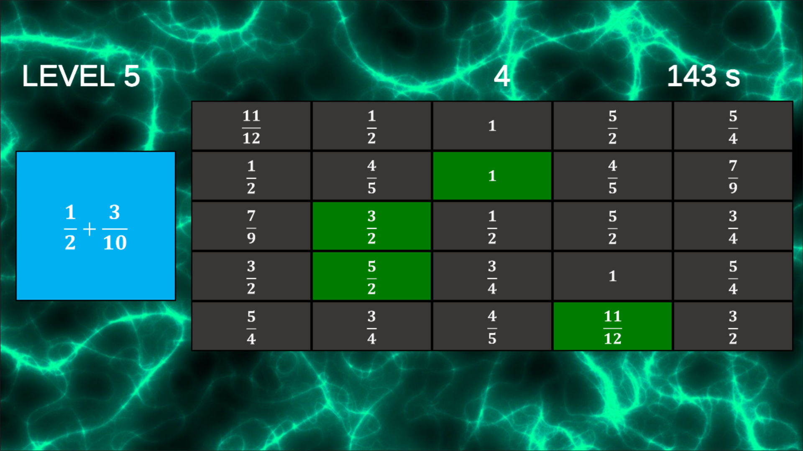
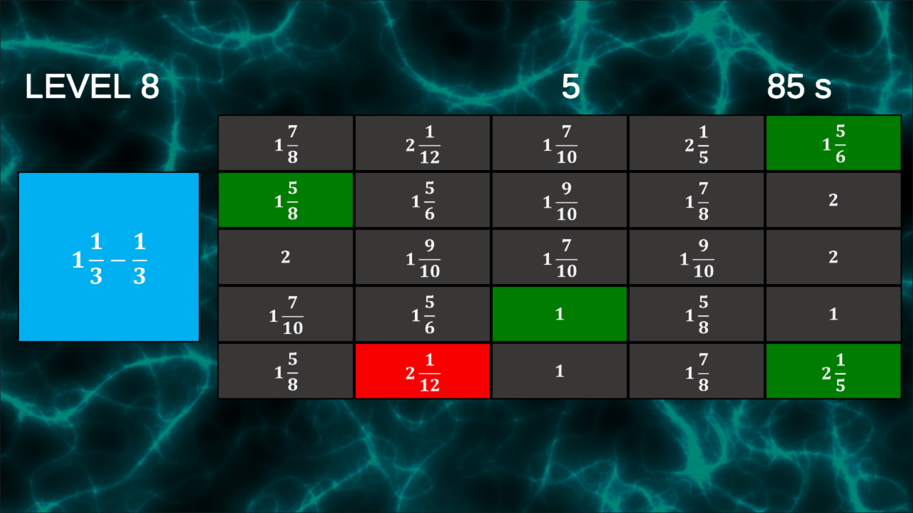
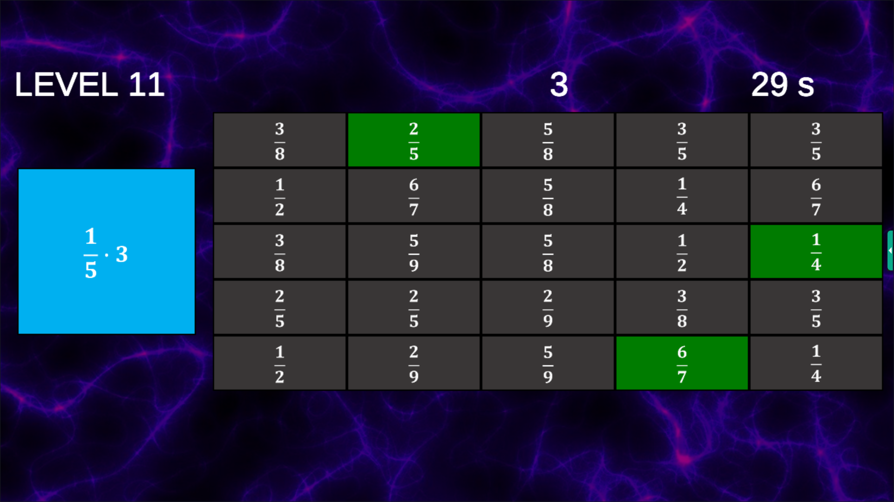
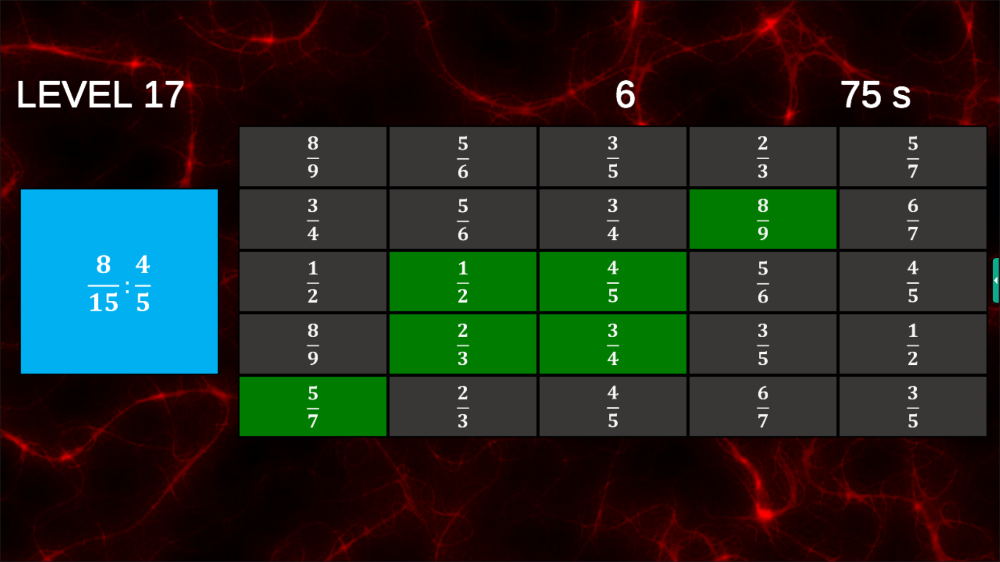
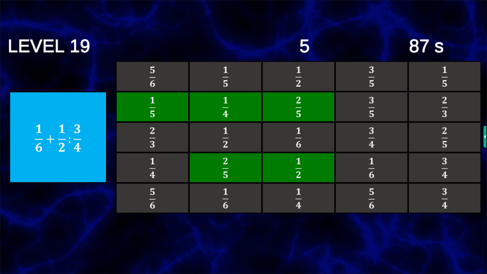
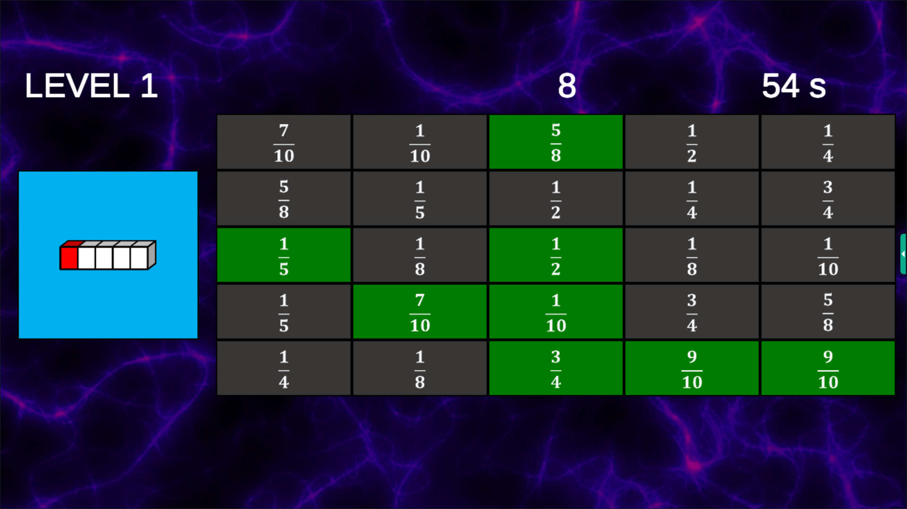

# Fraction Bingo

Fraction Bingo is a fun and educational math learning game that helps players practice arithmetic operations with fractions, simplifying fractions, and converting decimal numbers and shapes into fractions. The game combines the excitement of bingo with math learning, providing players with an engaging way to develop their skills.

## Game Description

Players are presented with a fraction-related task, the solution to which can be found in a 5x5 grid. The tasks may include operations with fractions, simplification, or converting decimal numbers into fractions. The player's goal is to find the correct answer in the grid and mark it down.

When a player successfully fills a horizontal, vertical, or diagonal line with the correct answers, they have completed that level. The game features a total of 20 different levels, offering varying challenges and opportunities to improve math skills at different difficulty levels.

## Features

- **Fun and Interactive Learning Experience:** Combines bingo with math learning.
- **Diverse Tasks:** Practice fractions, simplification, and conversion.
- **20 Unique Levels:** Provides varying challenges and allows players to progress according to their skills.
- **Visual Grid:** Easy-to-use interface that makes playing enjoyable.

## Instructions

- Start the game and select a level.
- Solve the given fraction-related task.
- Find the correct answer in the 5x5 grid.
- Mark down the correct answers.
- Complete a horizontal, vertical, or diagonal line to finish the level!

## Screenshots

## Also available for Android devices

